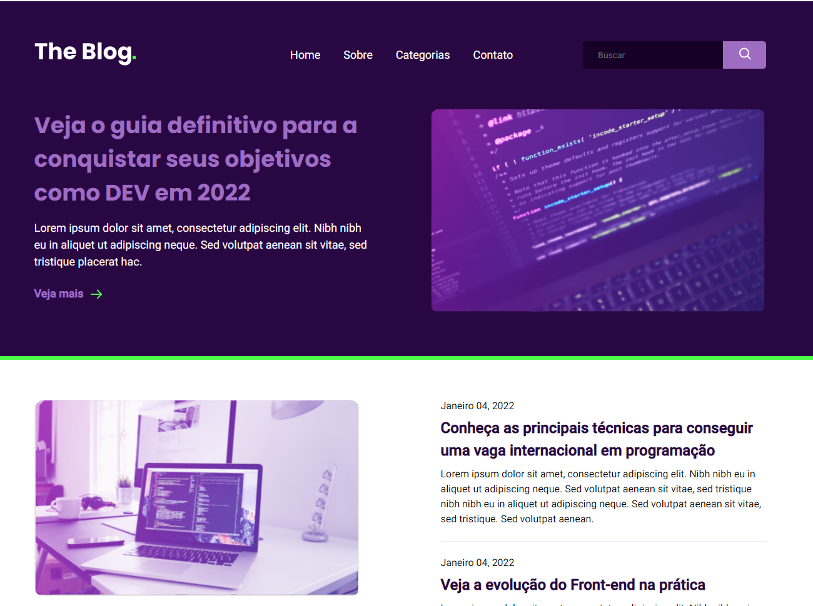

# Clone blog theme using ReactJS

Creating the template as it is drawn in figma. The project has only the home page, it was implemented with two media queries for the mobile version.

Criando o template como esta desenhado no figma. O projeto tem apenas a pagina da home, foi implementado com duas media query para versão mobile.

## Funcionalidades

- ReactJS
- Responsivo

## Screenshots

